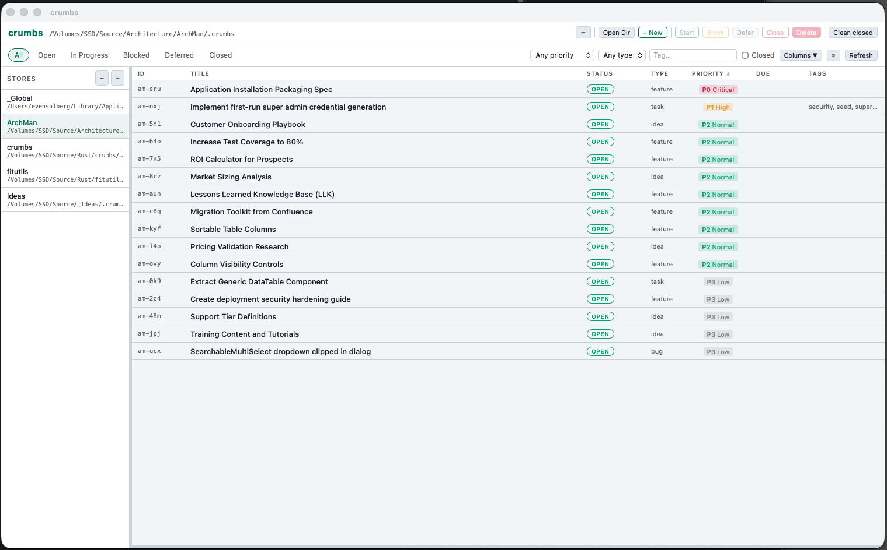

# crumbs

A flat-folder Markdown task tracker written in Rust. No daemon, no database — just `.md` files and a CSV index cache.

Available as a **CLI** (`crumbs`) and a **desktop GUI** (`crumbs-gui`, built with Tauri).

## Concept

Each item is a plain `.md` file with YAML frontmatter. An `index.csv` acts as a read cache and is rebuilt after every write. There is no server process; everything is a file operation.

Items live either in a local `.crumbs/` directory (per-project) or a global store:

| Platform | Global store path                       |
| -------- | --------------------------------------- |
| macOS    | `~/Library/Application Support/crumbs` |
| Linux    | `~/.local/share/crumbs`                 |
| Windows  | `%APPDATA%\crumbs`                      |

Because every item is a plain `.md` file, the store is trivially version-controlled. Commit `.crumbs/` to your repository and get full history, branching, and recovery via `git log`, `git diff`, and `git checkout`.

---

## Installation

### CLI

```sh
cargo install --path crumbs
```

Or download a pre-built binary from [GitHub Releases](https://github.com/evensolberg/crumbs/releases).

### GUI

Download the installer for your platform from [GitHub Releases](https://github.com/evensolberg/crumbs/releases):

| Platform              | Artifact              |
| --------------------- | --------------------- |
| macOS (Apple Silicon) | `.dmg`                |
| macOS (Intel)         | `.dmg`                |
| Linux                 | `.AppImage` / `.deb`  |
| Windows               | `.msi` / `.exe`       |

To build from source:

```sh
cargo tauri build
```

(requires the [Tauri CLI](https://tauri.app/start/prerequisites/) and a Rust toolchain)

---

## GUI overview



The GUI provides a full item management interface:

- **Sidebar** — manage multiple stores; click to switch, double-click or right-click to rename; drag rows onto another store to move items
- **Item table** — sortable columns, customisable visibility (click **Columns ▾**), resizable
- **Status strip** — live count of items in the current view with coloured status dots
- **Filters** — status buttons + priority, type, tag dropdowns, and a full-text **Search** bar (searches title and body)
- **Detail pane** — edit title (double-click), body (autosaves on blur/⌘S), tags, dependencies, due date, type, priority, and story points
- **Markdown preview** — click **Preview** in the detail pane to render the body as HTML
- **Priority badges** — colour-coded P0 Critical … P4 Backlog labels
- **Actions** — Start, Block (with inline new-blocker creation), Defer (with optional until date), Timer (start/stop with optional comment), Close, Delete, Clean closed
- **Next** — selects the highest-priority actionable item
- **Export** — saves all items as JSON, CSV, or TOON via a save dialog
- **Reindex** — rebuilds `index.csv` from `.md` files on disk

Column visibility and sidebar state persist across sessions via `localStorage`.

---

## Store resolution

crumbs locates its store in this order:

1. `--dir <path>` — explicit override
2. `--global` — platform global store (see table above)
3. `.crumbs/` under the current directory (auto-detected, walks up)
4. Global store as fallback

---

## CLI usage

### Initialize a store

```sh
crumbs init                    # local store in .crumbs/
crumbs init --global           # global store
crumbs init --prefix myp       # skip interactive prompt, set prefix directly
```

`crumbs init` prompts for an ID prefix (e.g. `cr`, `ma`), pre-filled from the directory name. The prefix is saved to `.crumbs/config.toml` and used for all new item IDs in that store.

### Create an item

```sh
crumbs create 'Fix the login bug' --item-type bug --priority 1 --tags project/auth
crumbs create 'Auth redesign' --message 'Covers login, OAuth, and session handling'
crumbs create 'Ship it' --due 2026-04-01 --points 5
crumbs c 'Quick idea'          # shorthand
# Tip: use single quotes to avoid shell expansion of !, $, etc.
```

| Flag              | Default | Values                                           |
| ----------------- | ------- | ------------------------------------------------ |
| `-t, --item-type` | `task`  | `task`, `bug`, `feature`, `epic`, `idea`         |
| `-p, --priority`  | `2`     | `0` (critical) … `4` (backlog)                   |
| `--tags`          | —       | comma-separated, e.g. `project/foo,needs-review` |
| `-m, --message`   | —       | freeform text stored in the markdown body        |
| `--depends`       | —       | comma-separated dependency IDs                   |
| `--due`           | —       | `YYYY-MM-DD`                                     |
| `--points`        | —       | story points (Fibonacci: 1 2 3 5 8 13 21)        |

### List items

```sh
crumbs list                    # open, in-progress, blocked, deferred
crumbs list --all              # include closed
crumbs list --status blocked
crumbs list --tag project/auth
crumbs list --priority 0       # P0 items only
crumbs list --verbose          # show first two body lines beneath each item
crumbs next                    # highest-priority actionable item (skips deferred with future until date)
```

### Inspect

```sh
crumbs show bc-x7q
crumbs show bc-x7q bc-y8r bc-z9s   # show multiple items
crumbs stats
crumbs search "login"
```

### Update an item

```sh
crumbs update bc-x7q --status in_progress
crumbs update bc-x7q --priority 0
crumbs update bc-x7q --tags project/auth,urgent
crumbs update bc-x7q --type bug
crumbs update bc-x7q --depends cr-abc,cr-xyz
crumbs update bc-x7q --due 2026-04-01
crumbs update bc-x7q --clear-due
crumbs update bc-x7q --message 'Now includes OAuth flow'
crumbs update bc-x7q --append 'See also PR #99'             # appends with [date] prefix
crumbs update bc-x7q --points 8
crumbs update bc-x7q --clear-points
```

`--tags` and `--depends` **replace** the existing list. `--append 'text'` adds to the body (with a `[YYYY-MM-DD]` prefix) instead of replacing it; `--message 'text'` replaces the body.

### Block and defer

```sh
crumbs block bc-x7q bc-y8r,bc-z9s   # bc-x7q blocks targets; targets → blocked status
crumbs block bc-x7q bc-y8r --remove  # unlink; targets reopen if nothing else blocks them
crumbs block bc-x7q                  # mark bc-x7q itself as blocked (no link)
crumbs defer bc-x7q                          # set status to deferred
crumbs defer bc-x7q --until 2026-04-01       # defer with a wake-up date
crumbs defer bc-x7q --reopen                 # reopen a deferred item
```

### Move and import between stores

```sh
crumbs move bc-x7q --to /path/to/other/.crumbs
crumbs move bc-x7q --to global
crumbs import glob-x7q --from global
crumbs import glob-x7q --from /path/to/.crumbs
```

Moved and imported items get a new ID using the destination store's prefix.

### Link items

```sh
crumbs link bc-x7q blocks bc-y8r             # bidirectional; sets bc-y8r to blocked
crumbs link bc-x7q blocks bc-y8r,bc-z9s
crumbs link bc-x7q blocked-by bc-z9s
crumbs link bc-x7q blocks bc-y8r --remove    # unlink; restores open if unblocked
```

### Close / delete

```sh
crumbs close bc-x7q
crumbs close bc-x7q --reason "fixed in PR #42"
crumbs delete cr-x7q
crumbs delete --closed            # purge all closed items
```

### Export

```sh
crumbs export                        # JSON to stdout
crumbs export --format csv
crumbs export --format toon          # compact, token-efficient for LLMs
crumbs export --format json --output items.json
```

### Time tracking

```sh
crumbs start bc-x7q                               # append [start] entry, set status to in_progress
crumbs start bc-x7q -m 'Investigating root cause'
crumbs stop  bc-x7q                               # append [stop] with elapsed time
crumbs stop  bc-x7q -m 'Fixed, opening PR'
crumbs show  bc-x7q                               # shows "Total tracked: Xh Ym Zs"
```

Timer entries are plain lines written into the markdown body, interleaved naturally with notes added via `--append`. Multiple start/stop cycles accumulate:

```markdown
[2026-03-08] Reproduced locally.
[start] 2026-03-08 09:00:00  Investigating root cause
[2026-03-08] Found the bug.
[stop]  2026-03-08 09:47:12  47m 12s  Fixed, needs review
[start] 2026-03-08 14:30:00
[stop]  2026-03-08 15:05:33  35m 33s  Addressed review comments
```

`crumbs show` sums matched pairs: `Total tracked: 1h 22m 45s`. Running `crumbs start` when a timer is already active prints "Already started at HH:MM:SS" and exits without modifying the file.

### Edit raw file

```sh
crumbs edit bc-x7q                   # opens in $EDITOR; reindexes on exit
crumbs reindex                       # rebuild index.csv manually
```

### Shell completions

```sh
crumbs completions zsh  > ~/.zfunc/_crumbs
crumbs completions bash > ~/.local/share/bash-completion/completions/crumbs
crumbs completions fish > ~/.config/fish/completions/crumbs.fish
crumbs completions powershell >> $PROFILE
```

### Global flags

| Flag               | Description              |
| ------------------ | ------------------------ |
| `-d, --dir <path>` | Use a specific directory |
| `-g, --global`     | Use the global store     |

---

## Frontmatter schema

```yaml
---
id: bc-x7q
title: "Example item"
status: open        # open | in_progress | blocked | deferred | closed
type: task          # task | bug | feature | epic | idea
priority: 2         # 0=critical … 4=backlog
tags:
  - project/crumbs
created: 2026-03-05
updated: 2026-03-05
closed_reason: ""
dependencies: []
blocks: []
blocked_by: []
due: 2026-04-01     # optional
story_points: ~     # optional integer; conventional values: 1, 2, 3, 5, 8, 13, 21 (Fibonacci)
---

# Example item

Body text in Markdown.
```

## File naming

Files are named after a slug of the title (max 60 chars). On collision the item ID suffix is appended, e.g. `my-task-x7q.md`.
